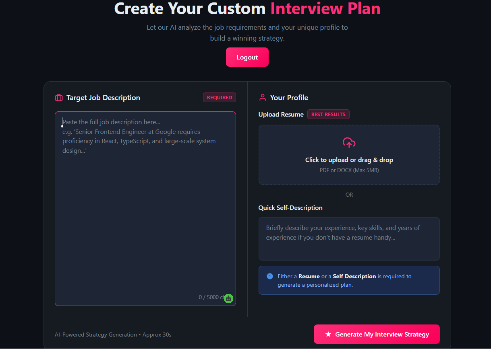
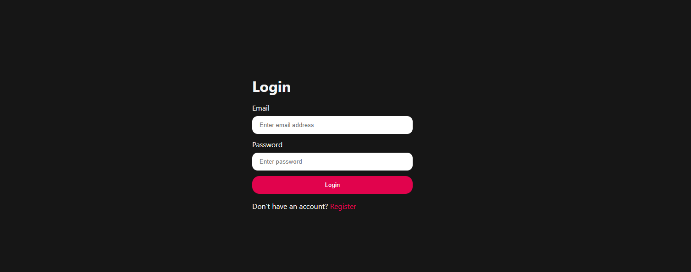
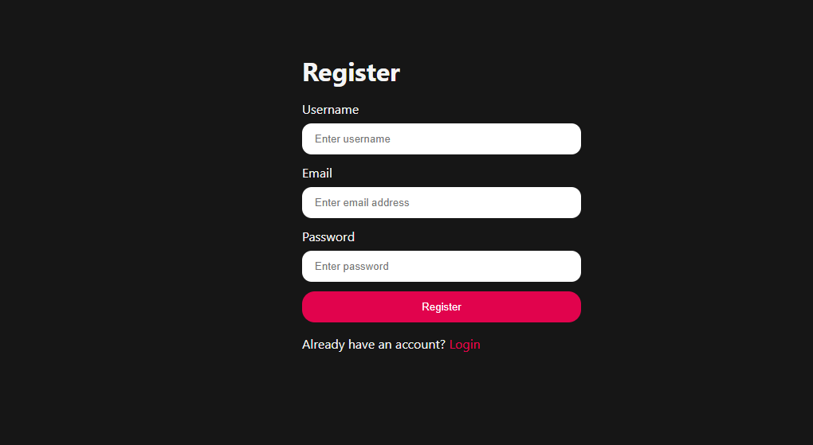
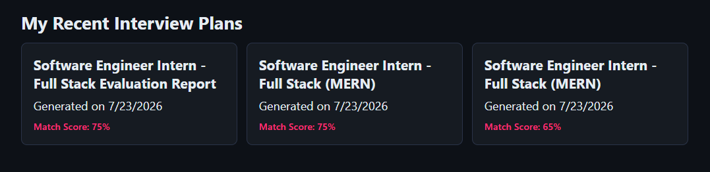
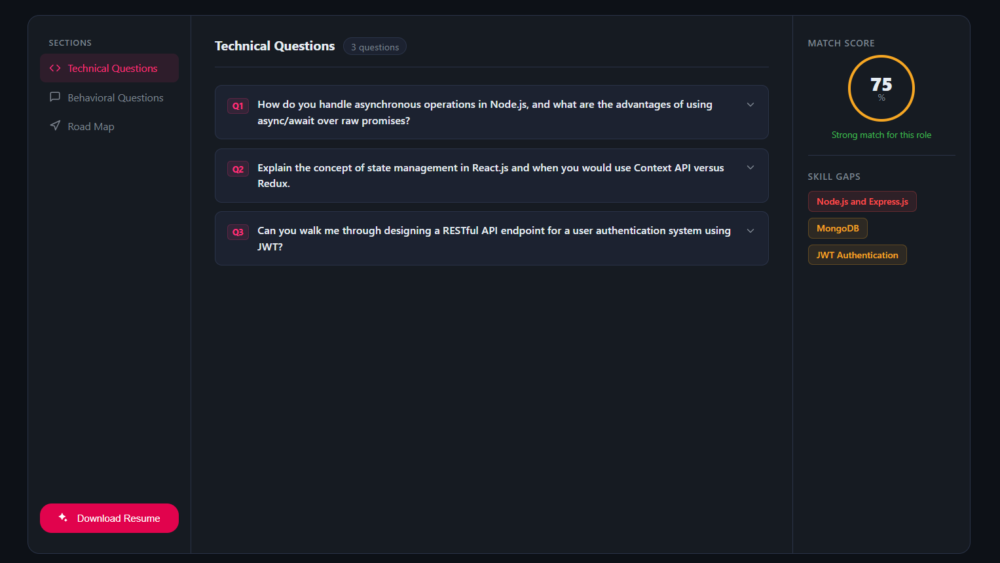

# InterView Helper

**Author:** KANISHKA RANI

This repository contains a full-stack interview preparation app with:
- `Backend/`: Node.js + Express API
- `Frontend/`: React + Vite SPA

## Deployed App

- Live link: https://interview-preparation-zgty.onrender.com/login

## Render Deployment

This repo is configured to deploy as two services on Render:
1. **Backend**: `Backend/` as a Node web service
2. **Frontend**: `Frontend/` as a static site

### Backend service settings
- Root Directory: `Backend`
- Build Command: `npm install`
- Start Command: `npm start`
- Environment: `Node`

#### Backend environment variables
- `MONGO_URI` — MongoDB connection string
- `JWT_SECRET` — JWT signing secret
- `GEMINI_API_KEY` — Gemini/OpenAI API key
- `CORS_ORIGIN` — Frontend URL, e.g. `https://<your-frontend>.onrender.com`
- `NODE_ENV` — `production`

### Frontend service settings
- Root Directory: `Frontend`
- Build Command: `npm install && npm run build`
- Publish Directory: `dist`
- Environment: `Static Site`

#### Frontend environment variables
- `VITE_API_BASE_URL` — backend URL, e.g. `https://<your-backend>.onrender.com`

### Notes for auth cookies
The backend now uses secure cross-site cookies for auth:
- `httpOnly: true`
- `secure: true` in production
- `sameSite: none`

This is required because the frontend and backend will run on different Render domains.

### Render manifest
A `render.yaml` file is included at the repository root to define both services.

### Deployment order
1. Deploy the backend service first.
2. Set `VITE_API_BASE_URL` in the frontend service to the backend URL.
3. Deploy the frontend service.

## Local development

### Backend
```bash
cd Backend
npm install
npm run dev
```

### Frontend
```bash
cd Frontend
npm install
npm run dev
```

## Screenshots

Use the images in the `IMAGES/` folder to preview the app pages:

- **Home**: 
- **Login**: 
- **Register**: 
- **Recent Reports**: 
- **Interview Report**: 
